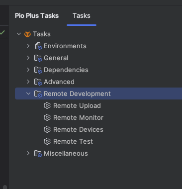
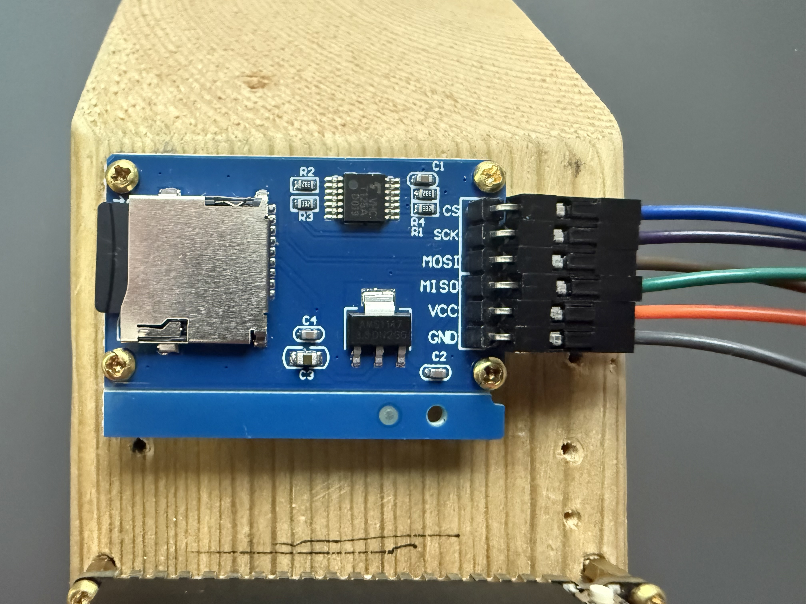
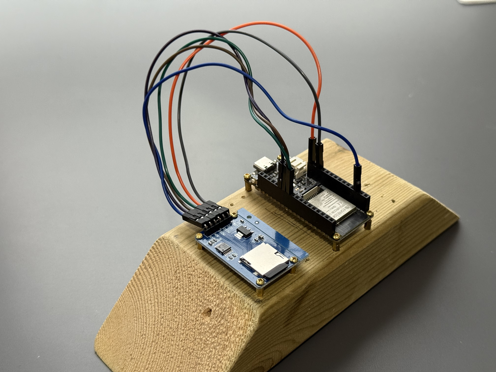

# Introduction
Within the developer community practice at [Opencast software](https://opencastsoftware.com/), once a month
we are given a problem to solve. We call this
the Learn by Doing initiative. These problems can range in difficulty, however, the premise is always the same: try
and solve the problem in a language you're not comfortable with or wish to learn more about. The idea behind this
initiative is that it's a great way to learn a new technology by just tackling a problem head on.

For July's Learn by Doing problem, we were tasked with creating a
[REST API](https://www.redhat.com/en/topics/api/what-is-a-rest-api) which returns river and rainfall
levels. In this post, I'll explore why I went with a
[Firebeetle 2 ESP32-E](https://wiki.dfrobot.com/FireBeetle_Board_ESP32_E_SKU_DFR0654), how did I implement this
solution, and what I learnt from it.

Within this read, I'll cover implementing the Flood API, the tools I used to implement it, and some of the challenges
I faced along the way.

## The problem

As previously mentioned, the problem revolved around creating a REST API. To implement this, I was provided an
[OpenAPI 3.1](https://github.com/JamieBriggsDev/ESP32-E-Flood-API/blob/main/openapi.yaml) contract to follow.
As for data for this API, I was also provided with an [SQLite3](https://sqlite.org/) database containing data captured
from [Defra's flood monitoring API](https://environment.data.gov.uk/flood-monitoring/doc/reference) that was captured
every day over two years.

The only constraint to this (aside from following the OpenAPI specification) was that a test suite should
pass when pointed to the REST API I have created. This test suite was created
by [Rob Anderson](https://robanderson.dev),
who created this challenge.

Given I was allowed to use any technology I wished, I decided to tackle this project using a
Firebeetle 2 ESP32-E microcontroller. While I've owned this microcontroller for a couple of years with the idea
to incorporate it into a
future [Home Assistant](https://www.home-assistant.io/) setup, I hesitated due to not having a 3D printer to create
protective enclosures for home deployment. This Learn by Doing challenge
presented the perfect opportunity to work with the ESP32-E as the requirements of the problem (i.e. networking and
database operations) aligned well with my future home automation plans.

This was an incredibly interesting challenge due to the nature of working with a Firebeetle 2 ESP32-E. Although this
microcontroller is low-powered and slow compared to your usual host for a REST API, it is also very portable. The scope
of the
problem was to read river and rainfall levels from a database, yet it could easily be extended to write new flood
information
to the database. This could be done either from the
existing [Defra flood monitoring API](https://environment.data.gov.uk/flood-monitoring/doc/reference),
or even contribute new data by being deployed to a real river site and record data in real time.

## Planning the environment and tooling

Before diving into the Flood API implementation, I spent some time setting up my development
environment and selecting the correct tools which would enable me to effectively create the Flood API.
This section outlines the approach I took, the libraries I researched, and a couple of side tools I
built along the way that ended up being quite useful, but not essential.

### The development environment

Before I started writing any code, I needed to decide what development environment I should use. The usual go-to
option is the [Arduino IDE](https://www.arduino.cc/en/software/)—a beginner-friendly platform primarily designed for
Arduino microcontrollers. Whilst it's great for simple projects, it becomes quite limited
when it comes to dependency management or more complex projects.

As an alternative, I opted for PlatformIO which builds on what Arduino IDE can do, but more. PlatformIO IDE
tends to come as a plugin for [CLion](https://www.jetbrains.com/clion/)
or [Visual Studio Code](https://code.visualstudio.com/)
rather than standalone software. Since I am comfortable with the
[JetBrains suite of products](https://www.jetbrains.com/), being able to use
CLion was perfect for me. The PlatformIO IDE also comes with tools for
dependency management, unit testing via [GoogleTest](https://github.com/google/googletest), and remote
upload functionality.

#### Working remotely

Although not essential for microcontroller development itself, PlatformIO’s remote capabilities turned out to be
particularly useful for this project. By using [PlatformIO Core](https://docs.platformio.org/en/latest/core/index.html)
(their CLI tool), I was able to connect my ESP32-E to a host machine (an old 2012 iMac in my case) and start a remote
agent like this:

```shell
% pui remote agent start
```

With the agent running, I could upload builds, monitor output, and even run tests remotely from any other machine using
the PlatformIO plugin. This setup was especially helpful since my main development machine is a MacBook Pro. It allowed
me to work from anywhere without needing to have the microcontroller physically connected at all times. The main
PlatformIO plugin doesn't actually have options for remote development despite it being available in PlatformIO Core.
Fortunately, the [Platformio Plus](https://plugins.jetbrains.com/plugin/20232-platformio-plus) plugin does.



### Key considerations

The next step was to think about libraries I would need to use. I had four main considerations:

1. How do I expose a web app?
2. How can I serialize an object into JSON?
3. How can I read an SQLite3 database?
4. How can I read a **22mb** file on a microcontroller with only 4MB of flash memory?

[PlatformIO Home](https://docs.platformio.org/en/latest/home/index.html) is a local user interface provided by the
PlatformIO plugin that helps configure projects. The user interface includes a library search
feature, which I used to address my first two considerations.

For exposing HTTP endpoints (consideration #1), I quickly found a few Arduino libraries that provide web server
functionality. For JSON serialization (consideration #2), I came across ArduinoJson, which is widely regarded as the
standard library for handling JSON on microcontrollers.

Addressing considerations #3 and #4 required more effort. I knew I’d be reading my SQLite3 database from a MicroSD card,
so I needed both a compatible [MicroSD SPI module](https://amzn.eu/d/8WP2FOO) and a library capable of reading SQLite
databases directly from
external storage. After some research, I
found [esp32_arduino_sqlite3_lib](https://github.com/siara-cc/esp32_arduino_sqlite3_lib),
a library developed by **siara-cc**. It supports
reading SQLite3 databases via various methods,
including MicroSD cards via [SPI](https://en.wikipedia.org/wiki/Serial_Peripheral_Interface). This library met both of my final
requirements. I did find that this library is not found within PlatformIOs library search. However, I could import it
into my project via [git submodules](https://git-scm.com/book/en/v2/Git-Tools-Submodules).

### Other useful tools

Although it was not required for this project, I took the opportunity to build a couple of additional tools that proved
helpful during development of the Flood API.

First, I wanted to experiment with my
[LCD1602](https://thepihut.com/products/lcd1602-i2c-module?srsltid=AfmBOorLb8S0ax1tl3QRIeDpDyE0VDgfE2X7FBOmzy0fpz9NUIbVgin_)
module. Getting feedback on the LCD in response to hitting various Flood API endpoints proved to be quite handy. This
was
especially useful for showcasing important runtime messages such as IP addresses without having to dig through logs.
You'll see it in various portions of my code with command like this:

```c++
// Display IP and PORT number
std::ostringstream portMessage;
portMessage << "Port: " << std::to_string(flood::config::PORT);
display->displayText(WiFi.localIP().toString().c_str(), portMessage.str(), common::display::STICKY);
```

I also created a cross-platform logger library. Usually, logging on a microcontroller looks like this:

```c++
Serial.println("My log!");
```

But since I wanted to run tests natively on my MacBook, I knew this default logging approach wouldn't work outside
of the microcontroller environment. So I built a logger that chooses the appropriate logging approach, including log
levels depending on the target platform:

```c++
LOG.debug_f("My log: %d", 125); 
```

With the `LOG` macro defined like so:
```c++
#if defined(ARDUINO) || defined(ESP32)


#include "LoggerSerial.h"
// Uses Serial.printLn() for logging
#define LOG jbriggs::common::logger::LoggerSerial::getInstance()

#else

#include "Logger.h"
// Uses cout for logging
#define LOG jbriggs::common::logger::Logger::getInstance()

#endif
```

Whilst these tools weren't part of the core Flood API functionality, they were valuable during development and may be
moved
into a common library for reuse in future projects. I won't be covering them in further detail here though.

## Implementation

Now that I had my development environment setup, it was time to start the implementation of the Flood API. Within this
section, I'll go through the various steps I took to implement the Flood API. This will include setting up the
device and its connections, connecting to the SQLite3 database, and creating a response which will be returned to the
client.

### Initial setup

Before touching any code, I needed to setup my ESP32-E microcontroller by connecting the 
[MicroSD SPI module](https://amzn.eu/d/7oocRs7) to the
correct pins. The pinout for the ESP32-E is can be found on the
[DFRobot website](https://wiki.dfrobot.com/FireBeetle_Board_ESP32_E_SKU_DFR0654#6.%20Pinout). The MicroSD SPI
module I have contains six pins which all need to be connected to the ESP32-E.



All but one of the pins have a specific pin they should be connected to on the ESP32-E.

| MicroSD Module Pin Name | Description          | Connecting ESP32 Pin            |
|-------------------------|----------------------|---------------------------------|
| CS                      | Chip Select          | Pin 4 (Used as input or output) |
| SCK                     | Serial Clock         | Standard SPI SCK pin            |
| MOSI                    | Master Out, Slave In | Standard SPI MOSI pin           |
| MISO                    | Master In, Slave Out | Standard SPI MISO pin           |
| VCC                     | 5V Power             | Standard VCC pin                |
| GND                     | Ground               | Standard GRN pin                |



### Connecting to my local network

Since the device needs to be accessible from within my home network, I needed to setup my WiFi connection. I used the
[Arduino WifiClient](https://docs.arduino.cc/language-reference/en/functions/wifi/client/) library to do this. This
library provides a simple way to setup WiFi credentials, and then automatically connect to the network:

```c++
WiFiClass::mode(WIFI_STA);
WiFi.begin(flood::config::WIFI_SSID, flood::config::WIFI_PASSWORD);
while (WiFiClass::status() != WL_CONNECTED)
{
delay(500);
display->displayText("Connecting..", common::display::FLASH);
}
LOG.debug_f("Connected to WiFi: %s", WiFi.localIP().toString().c_str());
```

I also displayed the IP address of the ESP32-E on the LCD, and the port number of the API:

```c++
// Display IP and PORT number
std::ostringstream portMessage;
portMessage << "Port: " << std::to_string(flood::config::PORT);
display->displayText(WiFi.localIP().toString().c_str(), portMessage.str(),
common::display::STICKY);
```

### Connecting to SQLite3

As [previously mentioned](#key-considerations), I found a crucial SQLite3 library specifically for ESP32
microcontrollers which supports accessing SQLite3 database files via SD cards. A lot of my implementation here
follows a good example which the library provides. Before actually reading the data from the
database file, some setup is required.

To begin, I needed to initialize the SPI bus, and SD library. I also make sure that the SD card is readable:

```c++
void FloodRepository::init()
{
  // Step 1: Initialize SPI and SD
  LOG.info("Initializing FloodRepository");

  LOG.debug("Beginning SPI");
  SPI.begin();
  LOG.debug("Beginning SD ");
  while (!SD.begin(config::MICRO_SD_CS_PIN))
  {
    LOG.error("Card Mount Failed");
  }

  uint8_t cardType = SD.cardType();
  if (cardType == CARD_NONE)
  {
    LOG.error("No SD card attached");
    throw std::runtime_error("No SD card attached");
  }

    ...
```

Next, I just make sure that the file I am going to be reading the flood data from is actually readable:

```c++
  // --- Continued: Still inside FloodRepository::init() ---
  
  // Step 2: Check the database file exists
  if (SD.exists(this->m_dbPath))
  {
    LOG.debug_f("Database file '%s' exists on SD card", this->m_dbPath);
    File file = SD.open(this->m_dbPath);
    LOG.debug_f("File size: %d", file.size());
    file.close();
  }
  else
  {
    LOG.error("Database file not found on SD card");
  }

    ...
```

Now that I know the SD card is mounted, and the database file is read, it's time to initialize the SQLite3 library:

```c++
  // --- Continued: Still inside FloodRepository::init() ---
  
  // Step 3: Initialize SQLite3
  LOG.info("Initializing SQLite3...");
  int initialize = sqlite3_initialize();
  if (initialize != SQLITE_OK)
  {
    LOG.error_f("Failed to initialize SQLite3: %s", initialize);
    throw std::runtime_error("Failed to initialize SQLite3");
  }
  
    ...
```

Once the library has been initialized, I open the database file:

```c++
  // --- Continued: Still inside FloodRepository::init() ---
  
  // Step 4: Open database file
  LOG.debug("Opening DB...");
  std::stringstream vfsPath;
  vfsPath << "/sd" << this->m_dbPath;
  if (openDb(vfsPath.str(), &m_floodDb) != SQLITE_OK)
  {
    LOG.error("Failed to open database");
    throw std::runtime_error("Failed to open database");
  }
  LOG.info_f("Connected to database!");
  
    ...
```

Once that is done, the database is actually in a usable state. there is one more thing I do during setup however to
better optimize my future calls to the database, and that is cache all station names found within the database to avoid
doing additional calls:

```c++
  // --- Continued: Still inside FloodRepository::init() ---
  
  // Step 5: Cache station names
  LOG.debug("Caching station names");
  auto stationNames = this->getAllStations();
  if (stationNames.empty())
  {
    LOG.error("Failed to get station names");
    throw std::runtime_error("Failed to get station names");
  }

  LOG.info("Completed initialization for FloodRepository");
}
```

### Mapping to something useful

Since my API needs to return JSON, I decided to create an intermediary service to map the objects returned
by my repository layer into JSON. Using [ArduinoJson](https://arduinojson.org/) made this process painless and
straightforward:

```c++
JsonDocument doc;
for (const auto& rainfallReading : rainfallReadings)
{
    JsonDocument reading;
    reading["timestamp"] = rainfallReading.timestamp;
    reading["level"] = rainfallReading.level;
    reading["station"] = rainfallReading.station;
    if (!doc["readings"].add(reading))
    {
      LOG.error("Failed to add reading");
      throw std::runtime_error("Failed to add reading");
    }
}
```

To convert this `JsonDocument` into an easy-to-read JSON output, ArduinoJson provides a handy function:

```c++
std::string json;
serializeJsonPretty(doc, json);
LOG.debug(json);
```

### Flood routes

#### Setting up WebServer

Within the Arduino core libraries for ESP32 is the
[WebServer](https://github.com/espressif/arduino-esp32/blob/master/libraries/WebServer/src/WebServer.h) class. This
class is a "dead simple web-server" that supports `GET` and `POST` HTTP methods; although limited, it is
perfect and lightweight for my use case of having a read-only API.

The setup for this web server is basic; all you need is to register a handler to a URI:

```c++
FloodRoutes::FloodRoutes(common::display::IDisplay* display, db::IFloodRepository* flood_repository,
                         mapper::IFloodMapper* flood_mapper) : m_server(config::PORT), m_display(display),
                                                                 m_floodRepository(flood_repository),
                                                                 m_floodMapper(flood_mapper)
{
  // Setup routes
  LOG.debug("Setting up routes...");
  // GET: /river
  m_server.on("/river", HTTP_GET,
              [this]
              {
                // Handles the response
                this->river();
              });
  
    ...
```

For handling a URI with a path parameter, `UriBraces` becomes useful as a matcher, and then the path parameter
can be extracted via the `WebServer`:

```c++
// --- Continued: Still inside FloodRoutes::FloodRoutes() ---

// GET: /rainfall/{stationName}
  m_server.on(UriBraces("/rainfall/{}"), HTTP_GET,
              [this]
              {
                const auto pathArg = m_server.pathArg(0);
                const std::string stationName(pathArg.c_str(), pathArg.length());
          
                // Handles the response
                this->rainfallStation(stationName);
              });
    ...
```

Finally, with WebServer setup, the server can be started:

```c++
// --- Continued: Still inside FloodRoutes::FloodRoutes() ---

  // Begin server
  LOG.debug("Starting server in FloodRoutes");
  m_server.begin();
}
```

#### Returning content on WebServer

With `WebServer` now initialized, I needed to send a response to the client. As you may have seen in the
[Setting up WebServer](#setting-up-webserver), as part of handling a URI, I called a function for both `/river` and
`/rainfall/{stationName}` which handles the response. Both functions are similar in functionality due to how much
logic is delegated to the [repository layer](#connecting-to-sqlite3) and [mappers](#mapping-to-something-useful).

The first step is to get any request parameters passed as part of the request. I created a handy function
which returns the value of a request parameter to help facilitate this. The `getQueryParameter`
function checks if a request param exists, and extracts it if it does. If the request
param does not exist, then return a default value:

```c++
std::string FloodRoutes::getQueryParameter(const std::string& param, const std::string& defaultValue)
{
  // Build string for LCD
  std::stringstream paramDisplay;
  paramDisplay << "Param " << param;
 
  // Check if request param is found on request
  const String paramName(param.c_str());
  if (!m_server.hasArg(paramName))
  {
    LOG.debug_f("Param %s not found", param.c_str());
    displayParamOnLCD(paramDisplay.str(), defaultValue.empty() ? "EMPTY" : defaultValue);
    // Return the default value if request param does not exist
    return defaultValue.empty() ? "" : defaultValue;
  }

  // Extract request param value
  const auto paramValue = m_server.arg(paramName);
  std::string result(paramValue.c_str(), paramValue.length());
  
  displayParamOnLCD(paramDisplay.str(), result);
  
  return result;
}
```

With `getQueryParameter()`, I could get the request parameters at the start of a request:

```c++
void FloodRoutes::river()
{
  LOG.info("/river requested");
  m_display->displayText("Calling", "/river", common::display::FLASH);
  
  // Get request parameters
  // Get the date parameter
  const std::string date = getQueryParameter("start");
  // Get limit parameter with default value, and convert to int
  const int limit = std::stoi(getQueryParameter("page", "1"));
  // Get page parameter with default value, and convert to int
  const int pagesize = std::stoi(getQueryParameter("pagesize", "12"));
  
    ...
```

Next, data needs to be fetched from the flood repository:

```c++
// --- Continued: Still inside FloodRoutes::river() ---

  const std::vector<db::RiverReading> readings 
    = m_floodRepository->getRiverReadings(date, limit, pagesize);
  
    ...
```

Finally, using my mapper, I could turn this data into JSON and return a response using `WebServer`:

```c++
// --- Continued: Still inside FloodRoutes::river() ---

  // Convert to JSON
  const JsonDocument doc = m_floodMapper->getFloodData(readings);
  std::string json;
  serializeJsonPretty(doc, json);

  const char* result = json.c_str();


  return m_server.send(200, "application/json", result);
}
```

The function for getting rainfalls for a station is very similar, only it has the addition of the path parameter
from the URI `/rainfall/{stationName}`, and a quick check to ensure that the station passed exists:

```c++
void FloodRoutes::rainfallStation(const std::string& stationName)
{
  // Get path param station name
  std::stringstream fullPath;
  fullPath << "/rainfall/" << stationName;
  LOG.info_f("/rainfall/{station} requested using %s", stationName);
  m_display->displayText("Calling", fullPath.str(), common::display::FLASH);

  // You can validate against your known stations
  if (!m_floodRepository->stationExists(stationName))
  {
    m_server.send(404, "application/json", R"({"error": "Invalid station name. Station not found."})");
    return;
  }

  // Get request parameters
  // Get the date parameter
  const std::string date = getQueryParameter("start", "2022-12-25");
  // Get limit parameter with default value
  const int limit = std::stoi(getQueryParameter("page", "1"));
  // Get page parameter with default value
  const int pagesize = std::stoi(getQueryParameter("pagesize", "12"));


  const std::vector<db::RainfallReading> rainfall_readings =
      m_floodRepository->getStationRainfallReadings(stationName, date, limit, pagesize);

  // Convert to JSON
  const JsonDocument doc = m_floodMapper->getRainfallReadings(rainfall_readings);
  std::string json;
  serializeJsonPretty(doc, json);

  return m_server.send(200, "application/json", json.c_str());
}
```

## What setbacks did I have

As this was my first embedded project, the implementation wasn't entirely straightforward. A couple of
things set myself back and made me reconsider approaches at times. Whilst these issues didn't stop the
project from completing, it definitely would shape how I design future projects on the ESP32 series of
microcontrollers.

### Partition tables

The next issue I had with the Flood API was storage. My Firebeetle 2 ESP32-E only contains 4MB of flash memory.
This does not mean I have 4MB to play with.

This default partition table ends allowing slightly more than 1MB of storage for your main app. Turns out for
the Flood API and the number of dependencies I was using, I needed slightly more than the default:

```shell
RAM:   [==        ]  17.5% (used 57412 bytes from 327680 bytes)
Flash: [==========]  115.2% (used 1509853 bytes from 1310720 bytes)
Error: The program size (1509853 bytes) is greater than maximum allowed (1310720 bytes)
```

To fix this, you can define your own partition table if you know what you're doing, however there are quite a
few default partition tables you can select from which probably fit all possible needs.:

```shell
jamie.briggs@G0GG60253H LearnByDoing % ls -l $HOME/.platformio/packages/framework-arduinoespressif32/tools/partitions
total 216
-rw-r--r--@ 1 jamie.briggs  staff   377  6 Jun  2024 app3M_fat9M_16MB.csv
-rw-r--r--@ 1 jamie.briggs  staff   447  6 Jun  2024 app3M_fat9M_fact512k_16MB.csv
-rw-r--r--@ 1 jamie.briggs  staff   374  6 Jun  2024 app3M_spiffs9M_fact512k_16MB.csv
-rw-r--r--@ 1 jamie.briggs  staff   125  6 Jun  2024 bare_minimum_2MB.csv
-rw-r--r--@ 1 jamie.briggs  staff  8192  6 Jun  2024 boot_app0.bin
-rw-r--r--@ 1 jamie.briggs  staff   304  6 Jun  2024 default_16MB.csv
-rw-r--r--@ 1 jamie.briggs  staff   304  6 Jun  2024 default_8MB.csv
-rw-r--r--@ 1 jamie.briggs  staff   305  6 Jun  2024 default_ffat_8MB.csv
-rw-r--r--@ 1 jamie.briggs  staff   304  6 Jun  2024 default_ffat.csv
-rw-r--r--@ 1 jamie.briggs  staff  3072  6 Jun  2024 default.bin
-rw-r--r--@ 1 jamie.briggs  staff   304  6 Jun  2024 default.csv
-rw-r--r--@ 1 jamie.briggs  staff   378  6 Jun  2024 ffat.csv
-rw-r--r--@ 1 jamie.briggs  staff   259  6 Jun  2024 huge_app.csv
-rw-r--r--@ 1 jamie.briggs  staff   307  6 Jun  2024 large_fat_32MB.csv
-rw-r--r--@ 1 jamie.briggs  staff   305  6 Jun  2024 large_ffat_8MB.csv
-rw-r--r--@ 1 jamie.briggs  staff   307  6 Jun  2024 large_littlefs_32MB.csv
-rw-r--r--@ 1 jamie.briggs  staff   304  6 Jun  2024 large_spiffs_16MB.csv
-rw-r--r--@ 1 jamie.briggs  staff   305  6 Jun  2024 large_spiffs_8MB.csv
-rw-r--r--@ 1 jamie.briggs  staff   216  6 Jun  2024 max_app_8MB.csv
-rw-r--r--@ 1 jamie.briggs  staff   303  6 Jun  2024 min_spiffs.csv
-rw-r--r--@ 1 jamie.briggs  staff   265  6 Jun  2024 minimal.csv
-rw-r--r--@ 1 jamie.briggs  staff   260  6 Jun  2024 no_ota.csv
-rw-r--r--@ 1 jamie.briggs  staff   260  6 Jun  2024 noota_3g.csv
-rw-r--r--@ 1 jamie.briggs  staff   334  6 Jun  2024 noota_3gffat.csv
-rw-r--r--@ 1 jamie.briggs  staff   334  6 Jun  2024 noota_ffat.csv
-rw-r--r--@ 1 jamie.briggs  staff   320  6 Jun  2024 rainmaker.csv
```

The default partition table is split into six partitions:

| Partition Name | Type | Size    | Purpose                                                                         |
|----------------|------|---------|---------------------------------------------------------------------------------|
| `nvs`          | data | 20KB    | Non-volatile storage. Usually holds Wi-Fi credentials, or user settings.        |
| `otadata`      | data | 8KB     | Stores over-the-air update metadata.                                            |
| `app0`         | app  | 1.25MB  | First firmware slot. Contains the application the user has created (Flood API). |
| `app1`         | app  | 1.25MB  | Second firmware slot. Used when updating.                                       |
| `spiffs`       | Data | 1.375MB | File system storage, used for storing assets like logs or data.                 |
| `coredump`     | Data | 64KB    | Reserved for crash dump data.                                                   |

The key thing here is that there is support for over-the-air updates. Whilst useful, for this project it's
unnecessary and I could take that storage for my own use. I also didn't need all the space on `spiffs` partition
as my SQLite3 database would be stored on a MicroSD card anyway. I went for `huge_app.csv` as it fit all of my needs:

| Partition Name | Type | Size  | Purpose                                                                            |
|----------------|------|-------|------------------------------------------------------------------------------------|
| `nvs`          | data | 20KB  | Non-volatile storage. Usually holds Wi-Fi credentials, or user settings.           |
| `otadata`      | data | 8KB   | Stores over-the-air update metadata. Not used due to lack of second app partition. |
| `app0`         | app  | 3MB   | The only firmware slot. Contains the application the user has created (Flood API). |
| `spiffs`       | Data | 896KB | File system storage, used for storing assets like logs or data.                    |
| `coredump`     | Data | 64KB  | Reserved for crash dump data.                                                      |

This partition table was then added to my `.platformio`:

```yaml
[ env:firebeetle2_esp32e ]
  platform = espressif32
  board = dfrobot_firebeetle2_esp32e
  framework = arduino
  test_framework = googletest
  monitor_speed = 115200
  board_build.partitions = huge_app.csv
```

If I needed even more space for the application, I could have created a custom partition table file and removed
`otadata` and
`spiffs` entirely. However, the defaults provided in `huge_app.csv` were more than sufficient for the projects needs.

This then allows the Flood API to fit on the ESP32-E with plenty of room. Although this meant that I couldn't update
the app remotely in a deployed setting, for this project it wasn't in scope. This does, however, highlight a crucial
drawback to this specific microcontroller when it comes to memory.

### SQLite3 compatibility issues

When I first set up the [repository layer](#connecting-to-sqlite3), I ran into an issue with
reading the SQLite3 database file. Initially, I suspected it was my own error, but testing with an example
database from the [SQLite3 library](https://github.com/siara-cc/esp32_arduino_sqlite3_lib) showed that the issue
was specific to the flood database file I was using.

I knew the file itself was fine - others working on the same challenge were using it without issues - so my next
suspicion was a compatibility problem with the library. Checking the database version confirmed the file was built with
SQLite `3.43.2`:

```shell
% file flood.db
flood.db: SQLite 3.x database, last written using SQLite version 3043002, writer version 2, read version 2, unused bytes 12, file counter 2378, database pages 6170, cookie 0x18, schema 4, UTF-8, version-valid-for 2378
```

The library I used was also based on this version, so I expected it to work. However my application logs showed that
this
was not the case:

```shell
[DEBUG] Beginning SPI
[DEBUG] Beginning SD
[DEBUG] Database file '/flood.db' exists on SD card
[DEBUG] File size: 25272320
[INFO] Initializing SQLite3...
[DEBUG] Opening DB...
[INFO] Opened database successfully: /sd/flood.db
[INFO] Connected to database!
[DEBUG] Caching station names
[DEBUG] Preparing query: SELECT * FROM StationNames
[ERROR] Failed to prepare statement: file is not a database
```

Locally, `flood.db` opened without issue. So I decided to recreate it myself. First, I dumped the database:

```shell
% sqlite3 flood.db .dump > flood_dump.sql 
```

I then downloaded [SQLite 3.43.2](https://github.com/sqlite/sqlite/releases/tag/version-3.43.2),
and built it from source:

```shell
% cd sqlite-version-3.43.2/
sqlite-version-3.43.2 % ./configure 
sqlite-version-3.43.2 % make 
```

Finally, I created a new database from the dump:

```shell
sqlite3 flood_recreated.db < flood_dump.sql
```

Using this newly created version of the flood database resolved the problem:

```shell
[INFO] Initializing SQLite3...
[DEBUG] Opening DB...
[INFO] Opened database successfully: /sd/flood_recreated.db
[INFO] Connected to database!
[DEBUG] Caching station names
[DEBUG] Preparing query: SELECT * FROM StationNames
[DEBUG] Stepping through statement
[DEBUG] Finalizing. Found 11 results.
[INFO] Completed initialization for FloodRepository
```

I'm still not so sure as to why the original file failed with this library, but recreating it allowed me to move
forward.

Whilst I did manage to get this working in the end, I did spend a large amount of time exploring other
database options. This was mainly due to both space constraints, which I explained in
the [Partition tables](#partition-tables) section.
At the time, I did not think I could modify partition tables, so I instead tried to find something more lightweight.

Whilst debugging the storage issues I was having, I briefly explored connecting to an external MySQL database. The idea
was
that offloading the search functionality to an external server would mean that the library I'd use for connecting to the
database
would be more lightweight. I did manage to get this working, however, it still didn't fix the underlying storage
limitations. In
retrospect, if I had fixed the partition tables before trying this, it would've worked completely fine as my tests
confirmed.
Although this idea was scrapped, it's handy to know it's possible to use an external MySQL database in a REST API
on a microcontroller.

## The final implementation

After a lot of work, the final Flood API was complete. With the ESP32-E started, I could connect to the API which
I had implemented.


With my ESP32-E powered on, I could make a request to the `/river` endpoint with three parameters:
```shell
% curl -X GET "http://192.168.1.249:80/river?start=2022-12-25&page=1&pagesize=12"
{
  "readings": [
    {
      "timestamp": "2022-12-25T00:00:00Z",
      "level": 0.864
    },
    {
      "timestamp": "2022-12-25T00:15:00Z",
      "level": 0.859
    },
    {
      "timestamp": "2022-12-25T00:30:00Z",
      "level": 0.857
    },
    {
      "timestamp": "2022-12-25T00:45:00Z",
      "level": 0.854
    },
    {
      "timestamp": "2022-12-25T01:00:00Z",
      "level": 0.853
    },
    {
      "timestamp": "2022-12-25T01:15:00Z",
      "level": 0.85
    },
    {
      "timestamp": "2022-12-25T01:30:00Z",
      "level": 0.85
    },
    {
      "timestamp": "2022-12-25T01:45:00Z",
      "level": 0.85
    },
    {
      "timestamp": "2022-12-25T02:00:00Z",
      "level": 0.85
    },
    {
      "timestamp": "2022-12-25T02:15:00Z",
      "level": 0.85
    },
    {
      "timestamp": "2022-12-25T02:30:00Z",
      "level": 0.85
    },
    {
      "timestamp": "2022-12-25T02:45:00Z",
      "level": 0.853
    }
  ]
}
```

And I could make a request to the `/rainfall/{stationName}` endpoint with a parth variable, and two request parameters:
```shell
% curl -X GET "http://192.168.1.249:80/rainfall/acomb-codlaw-hill?start=2024-02-01&page=101&pagesize=6"
{
  "readings": [
    {
      "timestamp": "2024-02-09T01:30:00Z",
      "level": 0.2,
      "station": "acomb-codlaw-hill"
    },
    {
      "timestamp": "2024-02-09T01:45:00Z",
      "level": 0.2,
      "station": "acomb-codlaw-hill"
    },
    {
      "timestamp": "2024-02-09T02:00:00Z",
      "level": 0.2,
      "station": "acomb-codlaw-hill"
    },
    {
      "timestamp": "2024-02-09T02:15:00Z",
      "level": 0.2,
      "station": "acomb-codlaw-hill"
    },
    {
      "timestamp": "2024-02-09T02:30:00Z",
      "level": 0.2,
      "station": "acomb-codlaw-hill"
    },
    {
      "timestamp": "2024-02-09T02:45:00Z",
      "level": 0.2,
      "station": "acomb-codlaw-hill"
    }
  ]
}
```

To ensure the API worked as expected, I ran the [provided test suite](#the-problem), which I could call to know if 
what I've done was working:

```shell
% ./FloodApiTests http://192.168.1.249:80
```

On first inspection the test suite works as expected, however, I did notice that some tests were failing. After
some investigation, I found that they were failing due to performance issues and the test suite was timing out. With
this in mind, I decided to ignore those failing tests and call it a success. This timeout is only due to multiple
requests being made at once, and the ESP32-E is not powerful enough to handle them. I also verified this by hitting
the endpoint manually.

## What I learned

The purpose of the Learn by Doing initiative is to undertake a project in a language or technology of your choice.
This is a great way to learn a new skill or technique, and this project was no exception. I gained a lot of experience
working with the ESP32-E, understanding what it can do, and how to use it effectively. The main goal of using this
microcontroller was to explore how it could be used in a home automation context, and I'm happy to know that it could
be used in this way.

The first and biggest thing I learned was how many libraries exist on the PlatformIO library registry, and without
a couple of libraries supporting the ESP32-E, I would've struggled to get this project working. I wanted to give
mention to the following libraries which helped me get this project working:

- [ArduinoJson](https://arduinojson.org/)
- [LiquidCrystal](https://docs.arduino.cc/libraries/liquidcrystal/)
- [ESP32 WebServer](https://github.com/espressif/arduino-esp32/tree/master/libraries/WebServer)
- [ESP32_Arduino_SQLite3_Lib](https://github.com/siara-cc/esp32_arduino_sqlite3_lib)
- [GoogleTest](https://github.com/google/googletest)

The next takeaway was the understanding of using external storage. I knew that the flash memory of an ESP32-E was
limited and always will be. Knowing that I could use an external storage device, such as a MicroSD card, allowed me to
explore how I could use this to store data. In this project I used it to store the SQLite3 database and could easily
write to that database as well if I were to record data instead.

The last thing I learnt was just how straightforward it is to set up a REST API on an ESP32-E. Using the
[ESP32 WebServer](https://github.com/espressif/arduino-esp32/tree/master/libraries/WebServer) library-as seen within
the [flood routes](#flood-routes) section-I was able to quickly build an API which could be used to
retrieve data from the SQLite3 database. While most of my use cases for the ESP32-E revolve around home automation,
adding `WebServer` to my devices would make it easy to query their status and gather additional information.

## What I'd do differently

The biggest thing I would do differently if I were to do this project again is to use a different microcontroller. The
Firebeetle 2 ESP32-E is a great microcontroller, yet the version I own has storage limitations which make it unsuitable
for this kind of application; although I was able to fit the application on the microcontroller, I had to disable any
over-the-air update
functionality to do so, making it impossible to update the application remotely. There are other models of this same
microcontroller
with more flash memory, specifically a [16MB variant](https://www.dfrobot.com/product-2837.html), which would allow me
to
hold the entire application without compromise.

If I wasn't limiting myself to what database solution I should use, I would've perhaps went with a MySQL database.
Realistically,
if I were setting up a home automation system, I'd like all the devices to be connected and storing data in the same
database to keep
all the data in one place. It would also mean that not every device I own would need to have a MicroSD card, making it
more
cost-effective.

## Wrap up

I would like to thank to [Rob Anderson](https://robanderson.dev/) for creating July's Learn by doing challenge, it
was incredibly interesting! July's Learn by doing project at Opencast software proved to be incredibly interesting. This
project was a great way to
explore the ESP32-E, and I'm looking forward to exploring more of its capabilities in the future.
